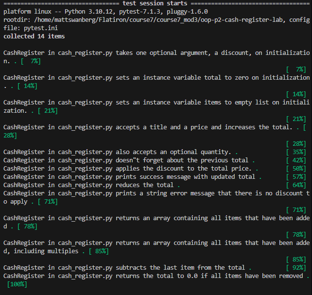

# Cash Register

## Description

The Cash Register application is a simple object-oriented Python program that simulates the core functionality of a cash register. It allows users to add items, apply percentage-based discounts, and void the most recent transaction while maintaining an accurate running total.

This project demonstrates the use of Python classes, object-oriented programming principles, lists, dictionaries, and basic transaction management.

---

## Features

- Add items to the cash register
- Track a running total
- Store purchased items
- Apply percentage-based discounts
- Void the most recent transaction
- Maintain a history of transactions

---

## Project Structure

```
lib/
├── cash_register.py
└── testing/
```

---

## Technologies Used

- Python 3
- Pytest

---

## How to Run

1. Clone the repository.

```bash
git clone <repository-url>
```

2. Navigate to the project directory.

```bash
cd <project-folder>
```

3. Install project dependencies.

```bash
pipenv install
```

4. Activate the virtual environment.

```bash
pipenv shell
```

5. Run the test suite.

```bash
pytest
```

---

## Example Usage

```python
from cash_register import CashRegister

register = CashRegister(20)

register.add_item("Apple", 1.50, 2)
register.add_item("Milk", 3.25)

register.apply_discount()
register.void_last_transaction()
```

---

## Screenshot

### Passing Test Suite



---

## Author

Created by Matt Swanberg as a part of Course 7 Module 3 (Object-Oriented Programming (OOP) - Part 2: Cash Register)